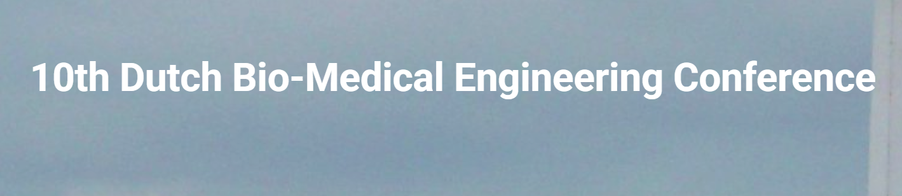

Dr. Elisabeth Wilhelm of the Faculty of Science and Engineering (RUG) is partner in a consortium receiving a EUR 1.2 million ERDF-subsidy to develop an app to guide diabetes patients to a drug-free life. Wilhelm will work on the scientific validation of all stages of the app's development and on the development of algorithms to be implemented in the application. The project is coordinated by Diavantis, a Dutch company focused on supporting people with type 2 diabetes. Elastique Health from Emmen is also a partner in the project.

<!-- 
 -->
<!--more-->

Add more details here
